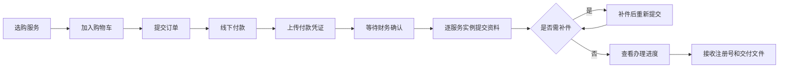
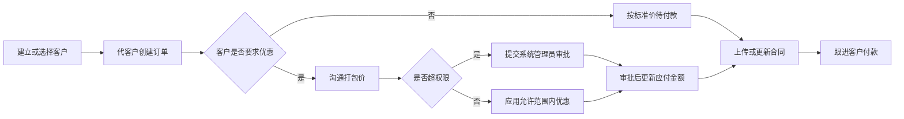
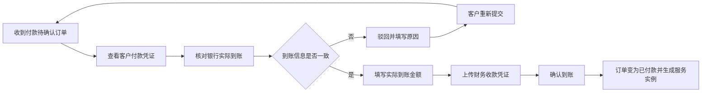
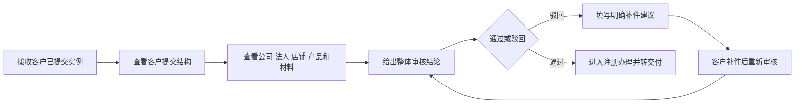
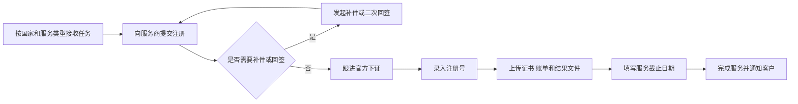

# EPR 下单系统业务流程图

## 端到端流程

```mermaid
flowchart LR
    C1[客户选购服务] --> C2[购物车结算或销售代客下单]
    C2 --> O1[生成待付款订单]
    O1 --> D{是否需要优惠}
    D -- 否 --> P1[按标准价付款]
    D -- 是 --> S1[销售沟通打包价]
    S1 --> A1[系统管理员审批]
    A1 --> A2[按标准金额比例分摊优惠]
    A2 --> P1
    P1 --> P2[客户线下付款并上传付款凭证]
    P2 --> F1[财务核对到账]
    F1 --> F2{是否确认到账}
    F2 -- 否 --> P3[驳回付款凭证并重新提交]
    P3 --> P2
    F2 -- 是 --> F3[上传收款凭证并记录实付金额]
    F3 --> I1[按购买数量生成服务实例]
    I1 --> C3[客户按实例提交资料]
    C3 --> B1[商务整体审核]
    B1 --> B2{审核结论}
    B2 -- 驳回 --> C4[客户按建议补件]
    C4 --> B1
    B2 -- 通过 --> D1[交付提交服务商]
    D1 --> D2[补件和二次回签]
    D2 --> D3[录入注册号并上传证书账单]
    D3 --> C5[客户查看交付结果]
```

## 客户流程

```mermaid
flowchart LR
    A[选购服务] --> B[加入购物车]
    B --> C[提交订单]
    C --> D[线下付款]
    D --> E[上传付款凭证]
    E --> F[等待财务确认]
    F --> G[逐服务实例提交资料]
    G --> H{是否需补件}
    H -- 是 --> I[补件后重新提交]
    I --> H
    H -- 否 --> J[查看办理进度]
    J --> K[接收注册号和交付文件]
```

## 销售流程

```mermaid
flowchart LR
    A[建立或选择客户] --> B[代客户创建订单]
    B --> C{客户是否要求优惠}
    C -- 否 --> D[按标准价待付款]
    C -- 是 --> E[沟通打包价]
    E --> F{是否超权限}
    F -- 是 --> G[提交系统管理员审批]
    F -- 否 --> H[应用允许范围内优惠]
    G --> I[审批后更新应付金额]
    H --> I
    D --> J[上传或更新合同]
    I --> J
    J --> K[跟进客户付款]
```

## 财务流程

```mermaid
flowchart LR
    A[收到付款待确认订单] --> B[查看客户付款凭证]
    B --> C[核对银行实际到账]
    C --> D{到账信息是否一致}
    D -- 否 --> E[驳回并填写原因]
    E --> F[客户重新提交]
    F --> A
    D -- 是 --> G[填写实际到账金额]
    G --> H[上传财务收款凭证]
    H --> I[确认到账]
    I --> J[订单变为已付款并生成服务实例]
```

## 商务流程

```mermaid
flowchart LR
    A[接收客户已提交实例] --> B[查看客户提交结构]
    B --> C[查看公司 法人 店铺 产品和材料]
    C --> D[给出整体审核结论]
    D --> E{通过或驳回}
    E -- 驳回 --> F[填写明确补件建议]
    F --> G[客户补件后重新审核]
    G --> D
    E -- 通过 --> H[进入注册办理并转交付]
```

## 交付流程

```mermaid
flowchart LR
    A[按国家和服务类型接收任务] --> B[向服务商提交注册]
    B --> C{是否需要补件或回签}
    C -- 是 --> D[发起补件或二次回签]
    D --> B
    C -- 否 --> E[跟进官方下证]
    E --> F[录入注册号]
    F --> G[上传证书 账单和结果文件]
    G --> H[填写服务截止日期]
    H --> I[完成服务并通知客户]
```

